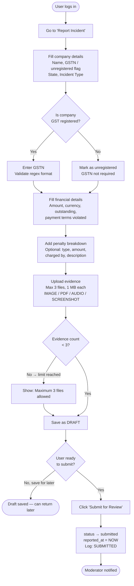
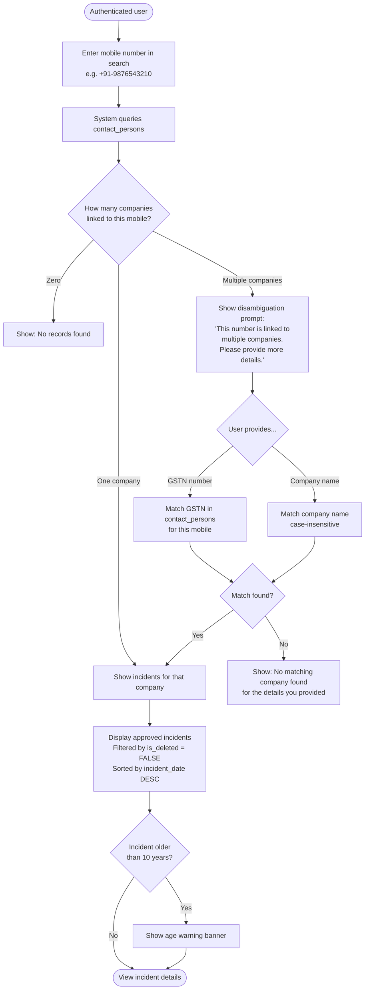
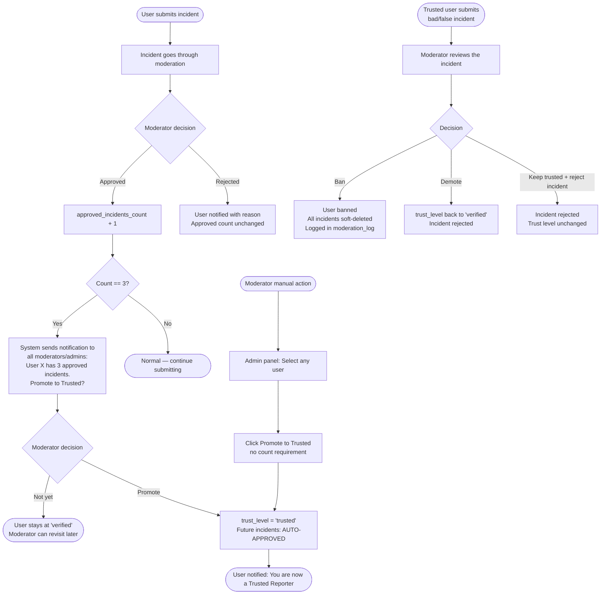
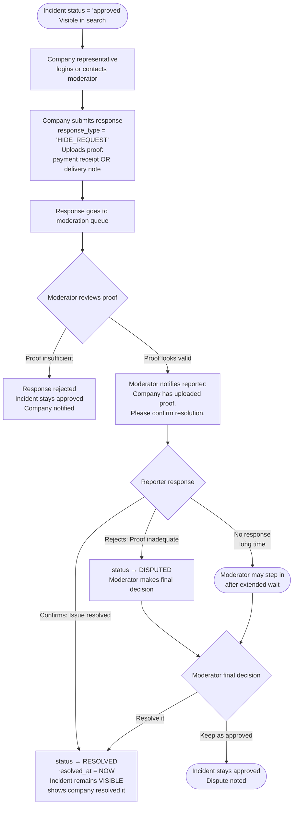
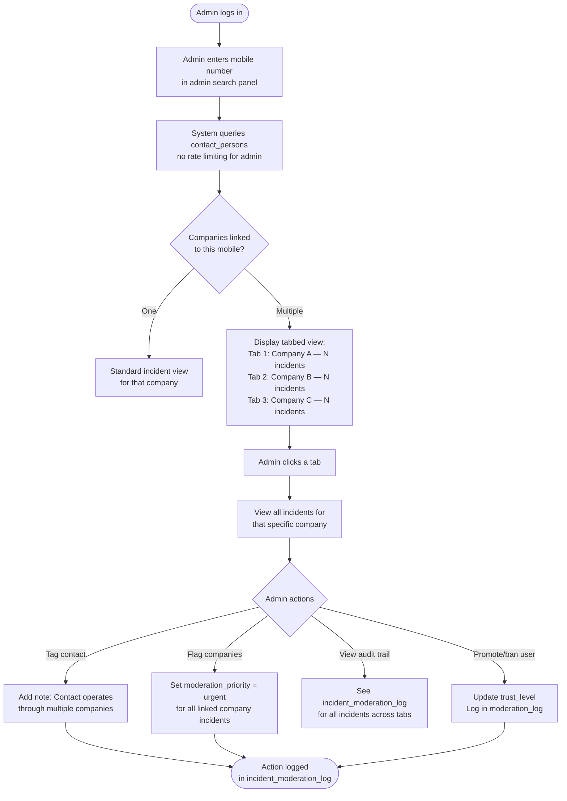

# User Flows — Foodlobbyin Incidents System

**Version**: 1.0  
**Date**: February 2026  

All diagrams use Mermaid syntax (rendered on GitHub) with ASCII fallback descriptions.

---

## 1. Incident Submission Flow



**ASCII Fallback**

```
User Login
    │
    ▼
Fill Incident Form
(Company Details + Financial Impact + Penalties + Evidence)
    │
    ├─── Save as DRAFT (can return later)
    │
    └─── Submit for Review
              │
              ▼
         status = 'submitted'
         Moderator queue notified
```

---

## 2. Mobile Search with Multiple Companies



**Key Privacy Rule**: The system never shows a dropdown list of company names associated with a mobile number. The user must already know the company they are searching for.

---

## 3. Trusted User Promotion Flow



---

## 4. Resolution with Proof Upload Flow



**Note**: There is no automatic timeout. The reporter must actively confirm or reject. The moderator can intervene if the reporter is unreachable after a prolonged period.

---

## 5. Forum Identity Disclosure Flow

```mermaid
flowchart TD
    A([User navigates to forum topic]) --> B{Topic has\nrequire_identity = TRUE?}
    B -- No --> C[User posts normally\nusing their default setting\nforums_default_anonymous]
    B -- Yes --> D{User's\nforums_default_anonymous?}
    D -- FALSE\nalready public --> E[Post submitted with real name\nno warning needed]
    D -- TRUE\nanonymous default --> F[Show warning dialog:\n⚠️ This topic requires your real name.\nYour identity will be visible\nfor THIS POST ONLY.\nYour default remains anonymous.\n\nCancel | Post with my name]
    F --> G{User clicks...}
    G -- Cancel --> H([Post cancelled\nUser returns to topic])
    G -- Post with my name --> I[Post stored with identity revealed\nfor this post ONLY]
    I --> J[User's forums_default_anonymous\nremains TRUE — unchanged]
    J --> K([User identity visible on this post\nbut protected on all future posts])
```

---

## 6. Admin Multi-Company View Flow



---

## Summary: Status Transitions Allowed

```
DRAFT         → submitted (reporter submits)
              → [deleted] (reporter deletes draft)

SUBMITTED     → under_review (moderator picks up)
              → withdrawn (reporter withdraws before moderation)

UNDER_REVIEW  → approved (moderator approves)
              → rejected (moderator rejects — reason required)

APPROVED      → disputed (company disputes via response flow)
              → withdrawn (reporter withdraws — only if no litigation_hold)
              → archived (admin action)
              → resolved (via resolution flow)

REJECTED      → submitted (reporter edits and resubmits)
              → withdrawn (reporter abandons)

DISPUTED      → resolved (reporter confirms or moderator resolves)
              → approved (moderator restores)

RESOLVED      → archived (admin action, optional)

WITHDRAWN     → submitted (reporter changes mind — moderator must approve reactivation)

ARCHIVED      → [permanent — no further transitions]
```

**Litigation hold rule**: If `litigation_hold = TRUE`, only `LITIGATION_HOLD_REMOVED` (admin action) and read operations are permitted. No status transitions or deletions.

---

*All flows incorporate the founder's clarifications from the questionnaire responses.*  
*Diagrams render in GitHub Markdown with Mermaid support.*
